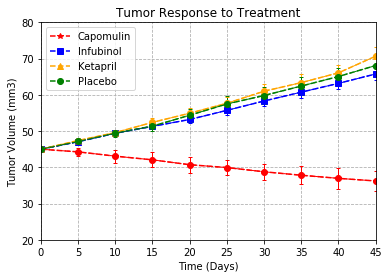
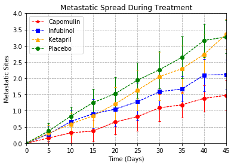
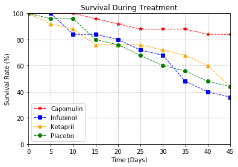
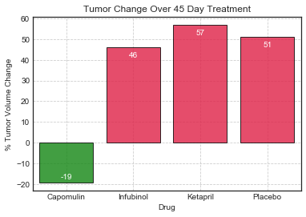

```python
# Dependencies
import numpy as np
import pandas as pd
from scipy import stats, integrate

import glob

import matplotlib.pyplot as plt
import seaborn as sns 
```


```python
# Read CSVs
clinical_trial = pd.read_csv('clinicaltrial_data.csv')
mouse_trial = pd.read_csv('mouse_drug_data.csv')
```


```python
#clinical_trial.head()
```


```python
#mouse_trial.head()
```


```python
trials = pd.merge(clinical_trial, mouse_trial, how='outer', on='Mouse ID')
```


```python
#trials.head()
```


```python
# Split up our data into groups based upon 'Drug' and 'Timepoint'
drug_groups = trials.groupby(['Drug','Timepoint'])
```


```python
#TUMOR VOLUME GRAPH STARTS HERE
```


```python
#Get mean tumor volume over time by drug and timepoint
t_vol = pd.DataFrame(drug_groups['Tumor Volume (mm3)'].mean())
```


```python
#t_vol.head()
```


```python
#pivot df
t_vol_reorg = t_vol[:]
t_vol_reorg.reset_index(level=['Drug','Timepoint'], inplace=True)
t_vol_piv = t_vol_reorg.pivot(index='Timepoint',columns='Drug',values='Tumor Volume (mm3)')
```


```python
#t_vol_piv
```


```python
#set x values
times = np.arange(0,50,5)
```


```python
#set stdev values
t_stdev = pd.DataFrame(drug_groups['Tumor Volume (mm3)'].std())
#t_stdev.head()
```


```python
#pivot stdev df
t_stdev_reorg = t_stdev[:]
t_stdev_reorg.reset_index(level=['Drug','Timepoint'], inplace=True)
t_stdev_piv = t_stdev_reorg.pivot(index='Timepoint',columns='Drug',values='Tumor Volume (mm3)')
```


```python
#t_stdev_piv
```


```python
#Your objective is to analyze the data to show how four treatments 
#(Capomulin, Infubinol, Ketapril, and Placebo) compare.

for x,m,c in zip(['Capomulin', 'Infubinol', 'Ketapril', 'Placebo']
                 ,['*','s','^','o']
                 ,['red','blue','orange','green']) :
    plt.plot(times, t_vol_piv[x], '--', color=c, label="%s" %x, marker=m)
    plt.errorbar(times, t_vol_piv[x], color=c, yerr=t_stdev_piv[x]/2, linewidth=1, fmt='--o', capsize=2)
    
#Add titles
plt.title("Tumor Response to Treatment")
plt.xlabel("Time (Days)")
plt.ylabel("Tumor Volume (mm3)")
#Add a legend
plt.legend(['Capomulin', 'Infubinol', 'Ketapril', 'Placebo'],loc="best")
# Set your x and y limits
plt.xlim(0,45)
plt.ylim(20, 80)
# Set a grid on the plot
plt.grid(linestyle='--')
```





```python
#METASTATIC SITES GRAPH STARTS HERE
```


```python
#Get mean num sites over time by drug and timepoint
t_sites = pd.DataFrame(drug_groups['Metastatic Sites'].mean())
```


```python
#t_sites.head()
```


```python
#pivot df
t_sites_reorg = t_sites[:]
t_sites_reorg.reset_index(level=['Drug','Timepoint'], inplace=True)
t_sites_piv = t_sites_reorg.pivot(index='Timepoint',columns='Drug',values='Metastatic Sites')
```


```python
#t_sites_piv
```


```python
#set stdev values
t_stdev2 = pd.DataFrame(drug_groups['Metastatic Sites'].std())
#t_stdev2.head()
```


```python
#pivot stdev df
t_stdev2_reorg = t_stdev2[:]
t_stdev2_reorg.reset_index(level=['Drug','Timepoint'], inplace=True)
t_stdev2_piv = t_stdev2_reorg.pivot(index='Timepoint',columns='Drug',values='Metastatic Sites')
```


```python
#t_stdev2_piv
```


```python
#Your objective is to analyze the data to show how four treatments 
#(Capomulin, Infubinol, Ketapril, and Placebo) compare.

for x,m,c in zip(['Capomulin', 'Infubinol', 'Ketapril', 'Placebo']
                 ,['*','s','^','o']
                 ,['red','blue','orange','green']) :
    plt.plot(times, t_sites_piv[x], '--', color=c, label="%s" %x, marker=m, linewidth=1)
    plt.errorbar(times, t_sites_piv[x], color=c, yerr=t_stdev2_piv[x]/2, linewidth=1, fmt='--o', capsize=2)
    
#Add titles
plt.title("Metastatic Spread During Treatment")
plt.xlabel("Time (Days)")
plt.ylabel("Metastatic Sites")
#Add a legend
plt.legend(['Capomulin', 'Infubinol', 'Ketapril', 'Placebo'],loc="best")
# Set your x and y limits
plt.xlim(0,45)
plt.ylim(0, 4)
# Set a grid on the plot
plt.grid(linestyle='--')
```





```python
#MOUSE COUNT GRAPH STARTS HERE
```


```python
#Get mean num sites over time by drug and timepoint
t_mice = pd.DataFrame(drug_groups['Mouse ID'].count())
```


```python
#t_mice.head()
```


```python
#pivot df
t_mice_reorg = t_mice[:]
t_mice_reorg.reset_index(level=['Drug','Timepoint'], inplace=True)
t_mice_piv = t_mice_reorg.pivot(index='Timepoint',columns='Drug',values='Mouse ID')
```


```python
#t_mice_piv.head()
```


```python
t_mice_perc = t_mice_piv
```


```python
drugs = t_mice_perc.columns.get_values()
```


```python
for x in drugs:
    t_mice_perc[x]=(t_mice_piv[x]/t_mice_piv[x][0])*100
#t_mice_perc.head()
```


```python
#Your objective is to analyze the data to show how four treatments 
#(Capomulin, Infubinol, Ketapril, and Placebo) compare.

for x,m,c in zip(['Capomulin', 'Infubinol', 'Ketapril', 'Placebo']
                 ,['*','s','^','o']
                 ,['red','blue','orange','green']) :
    plt.plot(times, t_mice_perc[x], '--', color=c, label="%s" %x, marker=m, linewidth=1)
    
#Add titles
plt.title("Survival During Treatment")
plt.xlabel("Time (Days)")
plt.ylabel("Survival Rate (%)")
plt.legend(['Capomulin', 'Infubinol', 'Ketapril', 'Placebo'],loc="best")
# Set your x and y limits
plt.xlim(0,45)
plt.ylim(0, 100)
# Set a grid on the plot
plt.grid(linestyle='--')
```





```python
#BAR GRAPH STARTS HERE
```


```python
perc_change = [((t_vol_piv[d][t_vol_piv.index.max()]-t_vol_piv[d][t_vol_piv.index.min()])/t_vol_piv[d][t_vol_piv.index.min()])*100 for d in drugs] 

sumstats = pd.DataFrame({
    "Drug": drugs,
    "% Tumor Volume Change": perc_change
})
sumstats.set_index(['Drug'], inplace=True, drop=True)
```


```python
#sumstats
```


```python
sumstats_red=sumstats.loc[['Capomulin', 'Infubinol', 'Ketapril', 'Placebo']]
#sumstats_red
```


```python
sumstats_red.reset_index(level=None, inplace=True)
bins = [-100,0,100]
colors = ['g', 'r']
sumstats_red["Color"]=pd.cut(sumstats_red["% Tumor Volume Change"], bins, labels=colors)
#sumstats_red
```


```python
sns.set_style("white")

custom_palette = [(0,.6,0,1) if (x < 0) else (1,0,.2,.1) for x in sumstats_red["% Tumor Volume Change"] ]
ax = sns.barplot(x="Drug", y="% Tumor Volume Change", data=sumstats_red,
                palette=custom_palette, alpha=.8, edgecolor=(0,0,0,1))

ax.set_title('Tumor Change Over 45 Day Treatment')

ax.grid(b=True, which='major', linestyle="--")
ax.grid(b=True, which='minor', linestyle="--")

total = float(len(sumstats_red))

for p in ax.patches:
    height = p.get_height()
    color = 'w' if height<0 else 'black'
    plus = 2 if height<0 else -5
    ax.text(p.get_x()+p.get_width()/2.,
            height + plus,
            '{:1.0f}'.format(height*4/total),
            ha="center", color='w') 

```




